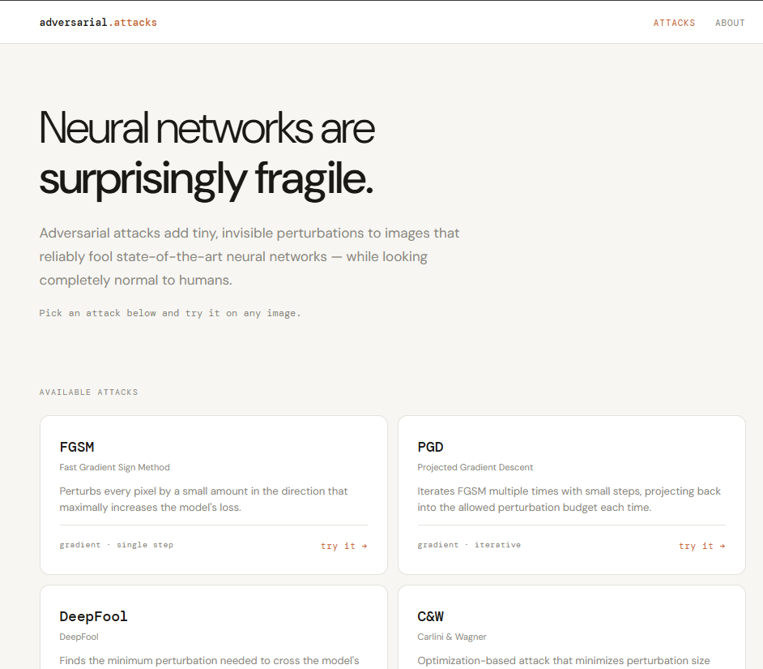
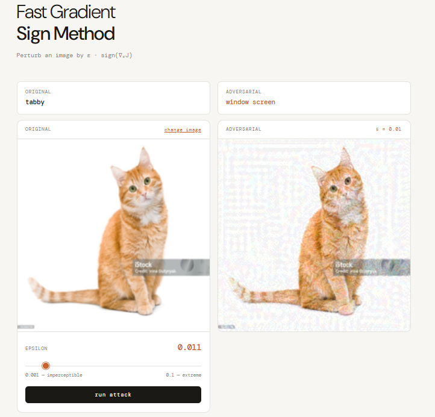
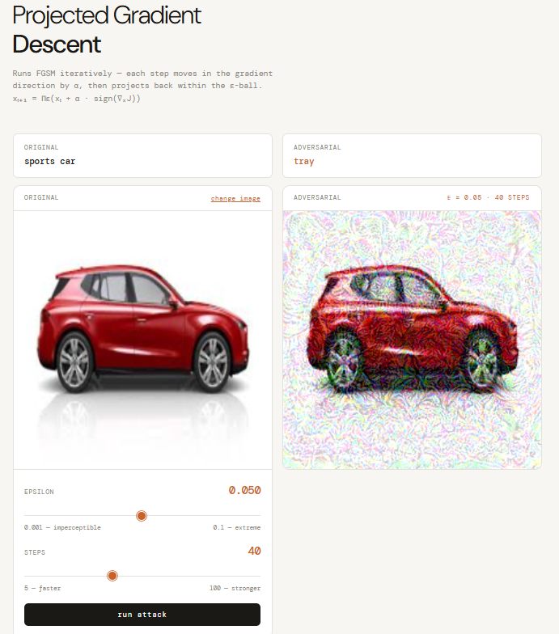

# Adversarial Attacks Visualizer

An interactive web application for exploring adversarial attacks on neural networks. Upload any image, choose an attack, and watch a state-of-the-art image classifier fail — while the image looks completely normal to the human eye.

**Live demo → [adversarial-attacks.vercel.app](https://adversarial-attacks.vercel.app)**



---

## What Are Adversarial Attacks?

Neural networks are vulnerable to carefully crafted perturbations that are invisible to humans but reliably cause misclassification. A tabby cat with imperceptible pixel-level noise added in the right direction can be confidently classified as a toaster. This project makes that phenomenon interactive and explorable.

All attacks run against **ResNet-18** pretrained on **ImageNet** (1000 classes).

---

## Attacks

### FGSM — Fast Gradient Sign Method
The foundational adversarial attack. Computes the gradient of the loss with respect to the input image, then takes a single step in the direction that maximally increases that loss.

**Formula:** `x_adv = x + ε · sign(∇ₓJ(x, y))`

Control epsilon to see the tradeoff between perturbation visibility and attack strength. At ε ≈ 0.03 (the academic standard for ImageNet), the image is nearly indistinguishable from the original.



---

### PGD — Projected Gradient Descent
The iterative extension of FGSM, widely considered the gold standard for evaluating model robustness. Instead of one large step, PGD takes many small steps — each time projecting back within the allowed ε-ball to stay within the perturbation budget.

**Formula:** `xₜ₊₁ = Πε(xₜ + α · sign(∇ₓJ))`

More powerful than FGSM at the same epsilon. Images that survive FGSM often fall to PGD.



---

### DeepFool
Rather than working within a fixed budget, DeepFool finds the geometrically shortest path to the model's decision boundary — the minimum perturbation required to cause misclassification. No epsilon parameter needed.

Tends to produce closely related misclassifications (tabby → tiger cat) rather than wildly different ones, since it only travels far enough to cross the nearest boundary.

> **Note:** On highly confident predictions, the decision boundary may be too far for the linear approximation to reach within the step budget. This is a known limitation when running DeepFool on large models like ResNet-18.

---

### C&W — Carlini & Wagner
An optimization-based attack that treats finding adversarial examples as a minimization problem, solved with the Adam optimizer. Minimizes a weighted combination of perturbation magnitude and misclassification confidence simultaneously.

**Objective:** `min ||δ||₂ + c · f(x + δ)`

The confidence parameter (κ) controls how aggressively wrong the model needs to be. At κ=0 the attack just needs to cross the boundary; higher values force the model to be more confidently wrong, requiring larger perturbations.

---

## Stack

| Layer | Technology |
|---|---|
| Frontend | Next.js (Pages Router), Tailwind CSS |
| Backend | FastAPI, PyTorch, torchattacks |
| Model | ResNet-18 pretrained on ImageNet |
| Frontend hosting | Vercel |
| Backend hosting | Hugging Face Spaces (Docker) |

---

## Architecture

```
GitHub (monorepo)
├── frontend/   →   Vercel (auto-deploys on push)
└── backend/    →   Hugging Face Spaces (Docker, manual push)

Request flow:
Browser → Next.js UI → POST /attacks/{method} → FastAPI → PyTorch → JSON response → UI renders result
```

The backend maintains a single preprocessing pipeline: images are resized to 224×224 and converted to [0,1] tensors. Normalization is applied just-in-time inside the model forward pass, keeping tensors in a clean range throughout the attack computation. All attacks use `set_normalization_used` so torchattacks handles the normalization bookkeeping internally.

---

## Repository Structure

```
adversarial-attacks/
├── backend/
│   ├── main.py          — FastAPI app, attack endpoints
│   ├── model.py         — ResNet-18 loading, preprocessing pipeline
│   ├── fgsm.py          — original manual FGSM implementation (reference)
│   ├── requirements.txt
│   └── Dockerfile
├── frontend/
│   ├── pages/
│   │   ├── index.js         — homepage, attack selection grid
│   │   ├── _app.js          — shared layout, navbar, global fonts
│   │   └── attacks/
│   │       ├── fgsm.js
│   │       ├── pgd.js
│   │       ├── deepfool.js
│   │       └── cw.js
│   └── components/
│       ├── AttackLayout.js  — shared two-panel page layout
│       ├── ImagePanel.js    — image display card
│       ├── EpsilonSlider.js — reusable parameter slider
│       ├── RunButton.js
│       ├── ErrorMessage.js
│       ├── Navbar.js
│       └── PredictionCard.js
└── README.md
```

---

## Further Reading

- [Explaining and Harnessing Adversarial Examples](https://arxiv.org/abs/1412.6572) — Goodfellow et al., 2014
- [Towards Deep Learning Models Resistant to Adversarial Attacks](https://arxiv.org/abs/1706.06083) — Madry et al., 2017 (PGD)
- [DeepFool: a simple and accurate method to fool deep neural networks](https://arxiv.org/abs/1511.04599) — Moosavi-Dezfooli et al., 2016
- [Evaluating Neural Network Robustness](https://arxiv.org/abs/1608.04644) — Carlini & Wagner, 2017
- [Deep Residual Learning for Image Recognition](https://arxiv.org/abs/1512.03385) — He et al., 2015

---

*Built by Muhammad Ashhad Ali*